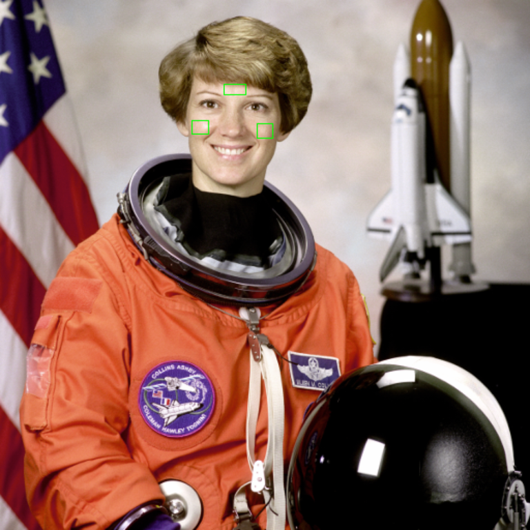
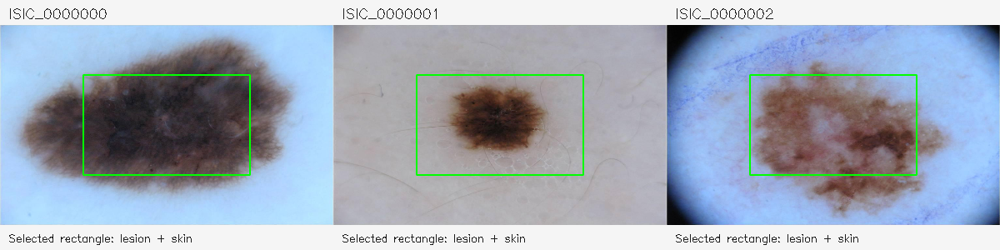

# Real-photograph results — 2026-10-02

Command: `.venv/bin/python -m unittest discover -s tests -v`.
Result: **7 tests passed**, no failures or errors, on the previously recorded Python 3.12.14 Linux environment. Tests cover fixture hashes, independent per-channel summation on three real medical photographs, channel permutation, boundary clipping, invalid rectangles, absence of faces in three dermoscopic images, and full face-landmark/ROI processing on four variants of one real portrait.

## Fixtures and findings

- ISIC_0000000, ISIC_0000001, ISIC_0000002: actual dermoscopic photographs; all three API metadata responses identify license CC-0 and attribution Anonymous. Central rectangles sample lesion plus surrounding skin; these are not clinical healthy-skin masks. Selected rectangle size is 196,224 pixels each. FaceMesh correctly returned no face on all three.
- NASA Eileen Collins portrait via scikit-image: actual photograph, public domain per scikit-image documentation. Original, mirrored, half-resolution and 75% encoded brightness variants all produced one face and all three nonempty finite ROIs.
- Initial visual inspection found the forehead rectangle overlapped hair. Changed candidate forehead landmarks from (109,10,338,151) to (107,9,336,151). The corrected rectangle lies on exposed central forehead in this photograph; cheek rectangles lie on skin. This observation is not a multi-subject anatomical validation.

Numeric rectangles, pixel counts and RGB means: `results/measurements.json`. Source URLs and fixture hashes: `fixtures/sources.json`.

## What this establishes

Real photographic files decode, the sampler preserves RGB order and gives correct pixel averages, clipping/rejection works, and the face model can run on a real face with useful candidate patches. The tests include unit checks of the sampler and integration checks of FaceMesh; face recognition/disease diagnosis are not evaluated.

## What this does not establish

These are encoded RGB photographs, not calibrated spectral reflectance or absolute photon-count measurements. Camera RGB depends on illuminant spectrum, skin reflectance, sensor response, exposure and nonlinear processing. Mean encoded pixel values test software arithmetic only. The NASA PNG emits an iCCP profile warning; no color-management or radiometric calibration is performed. Brightness transformation multiplies encoded pixels and does not simulate a physically calibrated illumination change.

No physiological labels, oxygen measurements, skin segmentation masks or demographic inference are used. The sample is three dermoscopy images and one portrait, not a population benchmark or evidence of robustness across skin tones. Still images cannot provide a pulsatile AC component or validate SpO2.

## Suitable follow-on sources

PAD-UFES-20 provides real smartphone clinical skin photographs (Pacheco et al., Data in Brief, DOI 10.1016/j.dib.2020.106221; original dataset https://data.mendeley.com/datasets/zr7vgbcyr2/1). No PAD-UFES images were downloaded in this run. These are useful for clinical-image processing, not facial pulse validation.

PhysioNet Video Pulse Signals in Stationary and Motion Conditions (https://physionet.org/content/videopulse/1.0.0/) exposes extracted pulse waveforms and references; its downloadable file listing contains signal files rather than source face photographs. It was not used as an image fixture source.

Next useful experiment: frontal-face video from additional consenting subjects, spanning acquisition conditions, with manually checked ROI placement. Oxygen estimation would separately require paired reference saturation and a validated measurement model.
